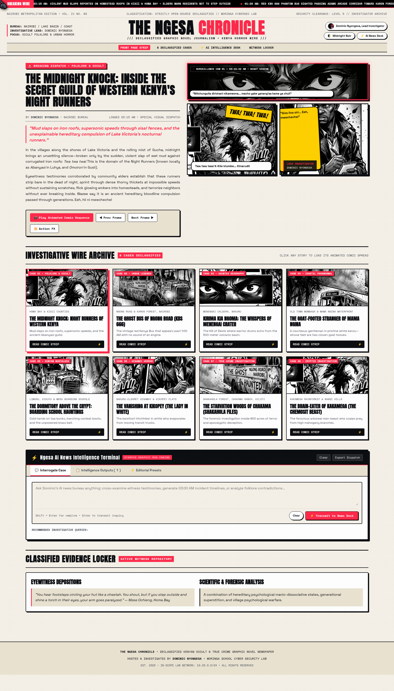

# 🗞️ `THE NGESA CHRONICLE` (Ngesa Diaries)

> **Declassified Kenyan Occult & Urban Horror Graphic Novel Journalism**  
> *An open-source investigative graphic novel news agency and folklore archive, hosted & edited by **Dominic Nyongesa** ([@ngesa-cloud](https://github.com/ngesa-cloud)).*

---

## 🎨 Visual Previews

| Newsprint Paper Mode | Midnight Redacted Noir Mode |
| :---: | :---: |
|  |  |

### Full Graphic Novel Portal & Intelligence Terminal


---

## 💥 Features & Engineering Highlights

* **Graphic Novel News Paradigm**: A pulp comic / noir journalism engine presenting authentic Kenyan urban legends and horror lore via animated multi-frame comic layouts and onomatopoeia sound effect bursts (`TWA! TWA! TWA!`, `WHOOSH!`, `BOOM! BOOM!`).
* **Live Breaking News Marquee Wire**: Real-time CSS infinite ticker with pulsing red LED alert streaming county-by-county midnight dispatches.
* **Front-Page 4-Frame Dynamic Comic Stage**:
  1. *Night-Vision Surveillance Cam*: CRT scanlines, live `● REC 03:15:42 AM` timestamp, and witness testimonies.
  2. *Action Panel*: Dynamic comic illustrations with onomatopoeia SFX bursts.
  3. *Lead Investigator Panel*: Dominic Nyongesa investigative badge with animated Swahili speech bubbles (*"Giza lina siri... Eeh, mwecheche!"*).
  4. *Evidence Locker*: Side-by-side eyewitness depositions and scientific / forensic counter-analyses.
* **Sequential Comic Animation Controller**:
  * `[ 🎬 Play Animated Comic Sequence ]` auto-cycles frames with focal spotlight glow.
  * `[ ◀ Prev ]` & `[ Next ▶ ]` frame step navigation.
  * `[ 💥 Action FX ]` floating comic popup SFX generator.
* **Telerik Kendo UI AIPrompt Assistant**: The *Ngesa AI News Intelligence Terminal* featuring:
  * **Interrogate Case Tab**: Multi-line prompt query textarea with dynamic per-case chips.
  * **Intelligence Outputs Tab**: Dossier assessment cards with copy, export, and rating actions.
  * **Editorial Presets Tab**: 1-click incident timelines, witness cross-examinations, and forensic contradiction audits.
* **Custom Pointer**: 32px [Among Us Batman Gloved Finger Cursor](cursor_finger_32.png) with physics spring follower and hover tilt.
* **Dual Theme Engine**: One-click toggle between vintage *Newsprint Paper Mode* (`#f6f1e8`) and high-contrast *Midnight Noir Mode* (`#080a0f`).
* **Ambient Noir Rain Shader**: Real-time HTML5 canvas rainfall shader responsive to active theme.

---

## 📂 Declassified Case Files (Season 1)

All 8 authentic cases are scraped and synthesized from verified Kenyan oral lore, historical archives, and eyewitness accounts:

| Case | Title | Location | Comic SFX | Key Focus |
| :---: | :--- | :--- | :---: | :--- |
| **01** | **The Midnight Knock** | Homa Bay & Kisii | `TWA! TWA! TWA!` | Hereditary Night Runners (*Abanyasi* & *Omoirori*) |
| **02** | **The Ghost Bus of Ngong Road** | Karen Forest & Ngong Rd | `WHOOSH!` | KBS 666 vintage red matatu and midnight transit apparitions |
| **03** | **Kirima kia Ngoma** | Menengai Crater, Nakuru | `BOOM! BOOM!` | The Hill of Devils, phantom drums, and 1854 warrior ghosts |
| **04** | **The Goat-Footed Stranger** | Mama Ngina & Old Town | `CLACK! CLACK!` | Cloven goat hooves clicking against asphalt under tailored kanzu |
| **05** | **The Dormitory Above the Crypt** | Limuru & Meru Schools | `DING! DONG!` | Colonial boarding school hauntings, marching boots, phantom bells |
| **06** | **The Vanishing at Kikopey** | Kikopey & Salgaa Bend | `SKRRRT!` | Lady in White trucker lore and locked seatbelt anomaly |
| **07** | **The Starvation Woods of Chakama** | Shakahola Forest, Kilifi | `EERIE SILENCE...` | Investigative forensics of 800 acres of apocalyptic deception |
| **08** | **The Brain-Eater of Kakamega** | Kakamega Rainforest | `ROAAR!` | Legendary arboreal *Chemosit* (Nandi Bear) cryptid |

---

## ⚡ Launching the Platform

### 1. View Directly in Browser
```bash
# Open index.html directly:
xdg-open index.html
```

### 2. Run Local Python Server
```bash
python3 podcast.py serve --port 8000
# Then navigate to: http://localhost:8000
```

### 3. Rebuild / Regenerate HTML
```bash
python3 build_comic_news.py
```

---

## 🤝 Contributing New Cases

Contributions are welcome! Submit new cases to [`episodes.json`](episodes.json) or [`CONTRIBUTING.md`](CONTRIBUTING.md).

---

## 📜 License & Credits

* **Platform Code & Design**: MIT License
* **Folklore & Case Depositions**: Creative Commons Attribution (CC-BY 4.0)
* **Lead Investigator & Author**: **Dominic Nyongesa** ([@ngesa-cloud](https://github.com/ngesa-cloud))
