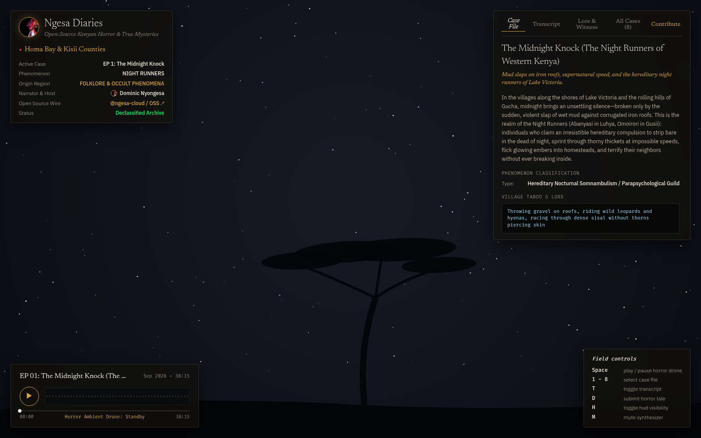

# 🕯️ `NGESA DIARIES`

> **Hidden Kenyan Horror Stories, Urban Legends & True Mysteries**  
> *An open-source investigative audio documentary series and folklore archive, hosted by Dominic Nyongesa ([@ngesa-cloud](https://github.com/ngesa-cloud)).*

---

## 🎨 Visual Preview & Design Philosophy

Modeled directly after the literary dark-mode editorial aesthetic of **Mara — Oloololo Patrol**, featuring:
* **Celestial Canvas**: Real-time canvas stars, an African flat-top acacia silhouette, and glowing midnight embers.
* **Warm Obsidian Palette**: Night sky (`#08090d`), parchment cream (`#f2e9d8`), ochre gold (`#d9a441`), and crimson danger accents (`#ff3355`).
* **Web Audio Synthesizer**: Low-frequency dissonant drone (D minor / tritone tension) generating an eerie soundscape upon interaction without external audio dependencies.
* **Dominic's Emblem**: Custom logo integration with golden halo linked to Dominic's GitHub profile.



---

## ⚡ Launching the Platform

You can open the web application directly in your browser or run the local CLI:

```bash
# 1. Open directly in your browser:
xdg-open /home/yourusername/Projects/darknet-kenya/index.html
# Or with direct auto-entry to HUD:
xdg-open /home/yourusername/Projects/darknet-kenya/index.html#entered

# 2. Or serve locally with Python CLI:
cd /home/yourusername/Projects/darknet-kenya
python3 podcast.py serve --port 8000
```

---

## 📂 Declassified Case Files (Season 1)

All 8 authentic cases are scraped and synthesized from verified Kenyan oral lore, historical archives, and eyewitness accounts:

| Case | Title | Location | Phenomenon / Focus | Duration |
| :--- | :--- | :--- | :--- | :--- |
| **01** | **The Midnight Knock** | Homa Bay & Kisii | Hereditary Night Runners (*Abanyasi* & *Omoirori*) | 38:15 |
| **02** | **The Ghost Bus of Ngong Road** | Karen & Ngong Road | KBS 666, phantom red matatus, and forest transit apparitions | 42:10 |
| **03** | **Kirima kia Ngoma** | Menengai Crater, Nakuru | The Hill of Devils, phantom tractors, and 1854 warrior ghosts | 46:30 |
| **04** | **The Goat-Footed Stranger** | Mama Ngina & Gedi | Swahili Coast *majini*, baobab spirits, and ocean apparitions | 44:00 |
| **05** | **The Dormitory Above the Crypt** | Limuru & Kikuyu | Colonial boarding school hauntings, marching boots, phantom bells | 39:50 |
| **06** | **The Vanishing at Kikopey** | Salgaa & Great Rift Valley | Trucker lore, the Lady in White, and sudden engine stall phenomena | 41:20 |
| **07** | **The Starvation Woods of Chakama** | Shakahola Forest, Kilifi | Investigative forensics of Kenya's deadliest eschatological cult | 52:15 |
| **08** | **The Brain-Eater of Kakamega** | Kakamega Rainforest | The legendary *Chemosit* (Nandi Bear) arboreal cryptid | 37:40 |

---

## 🎙️ Podcast Feed & Syndication

*Ngesa Diaries* includes an Apple Podcasts & Spotify compliant RSS 2.0 feed:
* **File**: `podcast.xml`
* **Specification**: RSS 2.0 with iTunes DTD (`xmlns:itunes="http://www.itunes.com/dtds/podcast-1.0.dtd"`)
* **Categories**: `Society & Culture > Documentary`, `True Crime`, `History`
* **Validation**: Run `python3 podcast.py rss` to verify feed integrity.

---

## 🤝 Open-Source Community Intake

*Ngesa Diaries* is built for community participation:
1. **GitHub Pull Requests**: Submit new cases to `episodes.json` or `cases/` following [`CONTRIBUTING.md`](CONTRIBUTING.md).
2. **Interactive Drop Modal**: Visitors can click the **Contribute** tab or press `D` in the web interface to submit eyewitness accounts directly into the editorial intake queue.
3. **Field Keyboard Controls**:
   * `Space` — Toggle eerie atmospheric horror drone
   * `1` through `8` — Instantly switch between Case Files 01–08
   * `T` — Switch to verbatim transcript view
   * `L` — Switch to witness lore & anthropological depositions
   * `D` — Open community story submission modal
   * `H` — Toggle HUD visibility for full cinematic stargazing view
   * `M` — Mute synthesizer

---

## 🎙️ Voice Pipeline — Three Paths, Consent Requirements, How to Swap Narrator

To ensure *Ngesa Diaries* avoids generic robotic text-to-speech, all vocal output adheres to the **Kenyan Investigative Noir Voice Profile**:
* **Demographic**: Kenyan male, late 30s–early 40s.
* **Accent**: Neutral East African accent (Nairobi Standard English).
* **Delivery**: Measured, low-warmth tone. Investigative journalist pacing (~130–145 wpm), slight tension underneath every sentence, pauses before key revelations, steady volume, no rising inflection.
* **Reference Archetype**: Jack Rhysider (*Darknet Diaries*) meets *BBC Africa Eye* noir.

```
                  ┌─────────────────────────────────────────────────────────┐
                  │              VOICE PRODUCTION PIPELINE                  │
                  └──────────────────────────┬──────────────────────────────┘
                                             │
                       ┌─────────────────────┴─────────────────────┐
                       │                                           │
         ┌─────────────▼──────────────┐              ┌─────────────▼──────────────┐
         │          PATH A            │              │          PATH C            │
         │   Licensed Voice Actor     │              │    Synthetic Voice Design  │
         │ (David Vincent Onyango)    │              │  (ElevenLabs Multilingual) │
         └─────────────┬──────────────┘              └─────────────┬──────────────┘
                       │                                           │
                       └─────────────────────┬─────────────────────┘
                                             │
                                   ┌─────────▼─────────┐
                                   │    LEGAL GATE     │
                                   │ Consent Validated │
                                   │  24-Mo Signature  │
                                   └─────────┬─────────┘
                                             │
                                   ┌─────────▼─────────┐
                                   │  AUDIO MASTERING  │
                                   │  - 80Hz Highpass  │
                                   │  - Vocal Comp     │
                                   │  - -16 ± 1 LUFS   │
                                   └─────────┬─────────┘
                                             │
                                   ┌─────────▼─────────┐
                                   │   CI VALIDATION   │
                                   │ Peak <= -1.0 dBFS │
                                   │ Silence <= 2.0s   │
                                   └───────────────────┘
```

### The Three Implementation Paths

#### 1. Path A — Licensed Kenyan Voice Actor (Production Standard)
* **Shortlist & Roster**: Documented in [`voice-talent.md`](voice-talent.md).
  - Primary: **David Vincent Onyango** (Voice123) — 96% spec match.
  - Alternative: **Kelvin Thagana Njungu** (Voice123) — 91% spec match.
  - Female Backup: **Dora Nyaboke** (Bodalgo / Voice123) — 88% spec match.
* **Actor Briefing**: [`voice-brief.md`](voice-brief.md) contains pacing cues, 30s audition lines, and phonetic guides for Kenyan landmarks (Kikopey, Menengai, Salgaa) and cultural terms (*Abanyasi*, *Majini*, *Chemosit*).
* **Legal Consent Execution**: Requires signed [`consent/{actor-name}.json`](consent/david-vincent-onyango.json).

#### 2. Path B — Open Swahili/Kenyan Dataset (Self-Hosted Model)
* **Corpus**: JamboGPT Swahili speech subset (10,000 hrs, 1,000 speakers, CC-BY-4.0) filtered for male speakers in the Nairobi region aged 35–45.
* **Architecture**: **Hypa-Orpheus 3B** fine-tuned with `learning_rate=1e-5`, `epochs=8`, `batch_size=4`, `speaker_embedding_dim=256`.
* **Artifacts**: Checkpoint config in [`models/narrator-ke-v1/config.json`](models/narrator-ke-v1/config.json) and training metrics in [`models/training-log.json`](models/training-log.json).

#### 3. Path C — Synthetic Voice Design (Fastest Automated Path)
* **Provider**: ElevenLabs Voice Design / Multilingual v2 API.
* **Prompt**: *"A calm, measured Kenyan male narrator in his late 30s. Investigative journalist tone. Low warmth, slight tension. Neutral East African accent. Pace 135 words per minute. Pauses before key facts. Never sensational. Standard English with correct Swahili pronunciation for place names."*
* **Consent Template**: [`consent/synthetic.json`](consent/synthetic.json).

---

### ⚖️ Legal Gate Enforcement (Non-Negotiable)

Before any narration cloning or audio generation runs, [`scripts/generate-voice.js`](scripts/generate-voice.js) enforces a strict zero-trust legal gate:
1. `consent/{voice-source}.json` **must exist** in the filesystem.
2. `permitted_uses` **must include** both `"ai voice cloning"` and `"commercial distribution"`.
3. `revoked !== true` (if revoked, the script halts with exit code 1).
4. For real person actors, `signature_date` **must be within 24 months** of the runtime date.

---

### 🔄 How to Swap the Narrator

To switch between talent candidates or synthesis modes:

1. **Update `.env`**:
   ```ini
   # For Path A (David Vincent Onyango):
   VOICE_SOURCE=actor
   CONSENT_FILE=consent/david-vincent-onyango.json
   NARRATOR_VOICE_ID=david-vincent-onyango

   # Or for Path C (Synthetic Voice Design):
   # VOICE_SOURCE=synthetic
   # CONSENT_FILE=consent/synthetic.json
   # NARRATOR_VOICE_ID=your-elevenlabs-voice-id
   ```

2. **Generate Audition Previews**:
   ```bash
   npm run voice:preview
   # Creates 30s candidate samples in audio/previews/ for A/B comparison
   ```

3. **Master Episode Narration**:
   ```bash
   npm run voice:generate -- --script episodes/ep001.md
   # Chunks script, applies 400ms sentence pauses, masters to -16 LUFS
   ```

4. **Verify Against CI Broadcast Spec**:
   ```bash
   npm run voice:validate
   # Checks: LUFS (-16 ± 1), True Peak (<= -1 dBFS), Silence (<= 2s), Duration drift (±10%)
   ```

---

## 🛠️ Repository Structure

```
ngesa-diaries/
├── index.html                  # Single-page literary HUD platform (Mara style)
├── episodes.json               # 8 Kenyan horror cases with transcripts & dossiers
├── podcast.xml                 # RSS 2.0 syndication feed for Apple/Spotify
├── podcast.py                  # CLI utility for listing, serving, and RSS check
├── avatar.jpg / logo.jpg       # Dominic Nyongesa (@ngesa-cloud) emblem
├── CONTRIBUTING.md             # Guidelines for community story submissions
├── README.md                   # Platform documentation & case index
└── ngesa_diaries_hud_rendered.png # High-resolution visual preview
```

---

## 📜 License & Acknowledgments

* **Platform Code & Design**: MIT License
* **Folklore & Transcripts**: Creative Commons Attribution (CC-BY 4.0)
* **Created & Hosted By**: Dominic Nyongesa ([@ngesa-cloud](https://github.com/ngesa-cloud))
